# Green Day: Rock Band Deluxe

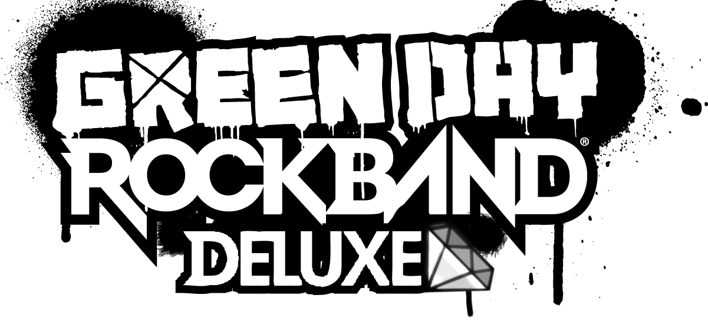

# Introduction

### Green Day: Rock Band Deluxe is a Massive Quality-of-Life Improvement Mod by [MiloHax](https://github.com/hmxmilohax)

This guide contains full instructions on how to install Green Day: Rock Band Deluxe for PlayStation 3 or Xbox 360.

# Table of Contents  
- [Features](#features)
  - [Quality of Life](#quality-of-life)
  - [Additional Modifications](#additional-modifications)
- [What You'll Need](#what-youll-need)
- [Downloads](#downloads)
- [How to Install](#how-to-install)
  - [Installing on RPCS3 (Recommended for PC)](#installing-on-rpcs3-recommended-for-pc)
  - [Installing on PS3](#installing-on-ps3)
  - [Installing on Xbox 360](#installing-on-xbox-360)
  - [Installing on Xenia](#installing-on-xenia) **(DEV/TESTING ONLY)**
- [Optional Upgrades](#optional-upgrades)
  - [Songs](#songs)
  - [Custom Textures](#custom-textures)
- [Repo Setup (Advanced)](#repo-setup-advanced)
- [Dependencies](#dependencies)

## Features

### Quality of Life
* No strum limit executable modification
* Fast start executable modification
* Additional intro skip scripting to skip the intro movie
* Allows loading all RB1/2 DLC (optional)
* "Overshell" - a custom on-screen menu system for changing speeds. Opened by pressing `SELECT, SELECT` on most menu screens
* Full Combo indicator per instrument via the multiplier
* Bass streak effect from RB3/RB4 available on all instruments
* Selectable song speed and track speed by 5% increments
* Selectable venue framerate up to 60fps
* Black Venue modifier with decreased load times and system load
* Song title always visible modifier
* Artist visible in song title
* Manual calibration adjusts by 1ms instead of 5ms

### Additional Modifications
* Nice (69%) and Awesome Choke (98-99%) callouts on solo completion
* Post processing modifier - disables/reenables post processing in-game, or in menus

# What You'll Need

### Playing Green Day: Rock Band Deluxe requires these things:

- **A vanilla copy of Green Day: Rock Band** for PS3 or Xbox 360 that you can extract onto your PC. The **USA** version is required for PS3 (`BLUS30350`)
- For Console: A **modded/hacked PS3 or Xbox 360** and a way to transfer files to it, we recommend using FTP
- For Emulator: A **mid-to-high-end PC** capable of running RPCS3

# Downloads

## PlayStation 3

### [Green Day: Rock Band Deluxe for PS3](https://nightly.link/hmxmilohax/greenday-rock-band-deluxe/workflows/build/main/GDRBDX-PS3.zip)

[GDRBDX (Vanilla Songs Only) for PS3](https://nightly.link/hmxmilohax/greenday-rock-band-deluxe/workflows/build/main/GDRBDX-PS3-vanilla-songs.zip)

*NOTE: Green Day: Rock Band Deluxe on PS3/RPCS3 installs differently compared to the other Deluxe projects.*

## Xbox 360

### [Green Day: Rock Band Deluxe for Xbox 360](https://nightly.link/hmxmilohax/greenday-rock-band-deluxe/workflows/build/main/GDRBDX-Xbox.zip)

[GDRBDX (Vanilla Songs Only) for Xbox 360](https://nightly.link/hmxmilohax/greenday-rock-band-deluxe/workflows/build/main/GDRBDX-Xbox-vanilla-songs.zip)

# How to Install

## Installing on [RPCS3](https://rpcs3.net/) (Recommended for PC)

*NOTE: Green Day: Rock Band Deluxe on PS3/RPCS3 installs differently compared to the other Deluxe projects.*

* **Install your North American copy of Green Day: Rock Band** through the emulator. The [**official RPCS3 site covers this nicely**](https://rpcs3.net/quickstart).
  * Remember, **you need to be running** ***BLUS30350***. RPCS3 will tell you this in the game selection GUI under the `Serial` column.

* Download [**Green Day: Rock Band Deluxe for PS3**](#playstation-3). 
  * Extract the zip and **copy the contents to the `PS3_GAME` folder on your vanilla copy of Green Day: Rock Band**. Select `Yes` to overwrite the files if asked.

***Green Day: Rock Band Deluxe is now installed!*** We highly recommend you check out [**Optional Upgrades**](#optional-upgrades) for songs and other cool stuff you can add to your game.

**To update Green Day: Rock Band Deluxe**, [**re-download it**](#playstation-3) and repeat the above steps. You can click the `Watch` button (All Activity) to be notified about any updates that occur.

*Sidenote: it is normal for Green Day: Rock Band to take longer to start up on PS3 and isn't really something we can fix.*

***Sidenote:*** *we recommend* ***enabling `Write Color Buffers`*** *for Green Day: Rock Band to prevent any character model issues.*

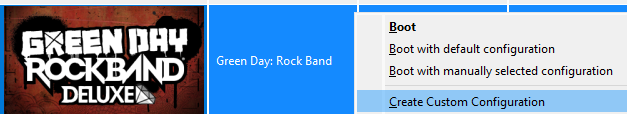
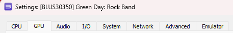
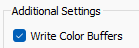

## Installing on PS3

**NOTE: You WILL need a HACKED/MODDED (CFW or HFW/HEN) PS3 in order to play this mod on console. We hope this is clear.**

**NOTE: Green Day: Rock Band Deluxe only works with** ***North American (`BLUS30350`)*** **copies of the game on PS3.**

*NOTE: Green Day: Rock Band Deluxe on PS3/RPCS3 installs differently compared to the other Deluxe projects.*

* **Dump or extract your North American copy of Green Day: Rock Band** to your PS3's hard drive.
  * Remember, **you need to be running** ***BLUS30350***.

* Download [**Green Day: Rock Band Deluxe for PS3**](#playstation-3). 
  * Extract the zip and **copy the contents to where your vanilla copy of Green Day: Rock Band is installed** (we recommend using FTP to do so).
    * If you used MultiMan to dump your game, it should be in `\dev_hdd0\GAMES\BLUS30350-[Green Day Rock Band]\PS3_GAME\`.
  * Select `Yes` to overwrite the files if asked.

***Green Day: Rock Band Deluxe is now installed!*** We highly recommend you check out [**Optional Upgrades**](#optional-upgrades) for songs and other cool stuff you can add to your game.

**To update Green Day: Rock Band Deluxe**, [**re-download it**](#playstation-3) and repeat the above steps. You can click the `Watch` button (All Activity) to be notified about any updates that occur.

*Sidenote: it is normal for Green Day: Rock Band to take longer to start up on PS3 and isn't really something we can fix.*

## Installing on Xbox 360

**NOTE: You WILL need a HACKED/MODDED (RGH or JTAG) Xbox 360 in order to play this mod on console. We hope this is clear.**

* **Install your vanilla copy of Green Day: Rock Band** to your console's hard drive.
  * In case anything goes wrong, we recommend that you **rename `default.xex` to `default_vanilla.xex`**.

* Download [**Green Day: Rock Band Deluxe for Xbox 360**](#xbox-360). 
  * **Copy the contents of it to where your copy of Green Day: Rock Band is installed** (we recommend using FTP to do so). Select `Yes` to overwrite the files.

* We also recommend **clearing your song cache**, as well as your **system cache**.
  * *To clear your **song cache**, navigate to `System Settings > Storage > Green Day: Rock Band` and delete the song cache.*
  * *To clear your **system cache**, navigate to `System Settings > Storage` and press `Y` to clear the system cache.*

***Green Day: Rock Band Deluxe is now installed!*** We highly recommend you check out [**Optional Upgrades**](#optional-upgrades) for songs and other cool stuff you can add to your game.

**To update Green Day: Rock Band Deluxe**, [**re-download it**](#xbox-360) and repeat the above steps. You can click the `Watch` button (All Activity) to be notified about any updates that occur.

## Installing on Xenia

### ***WARNING: GREEN DAY: ROCK BAND IS UNPLAYABLE ON XENIA AND IS USED FOR DEVELOPMENT AND TESTING PURPOSES ONLY!!!***

*Follow [**Repo Setup (Advanced)**](#repo-setup-advanced) first in order to properly follow this guide.*

* **Extract your vanilla copy of Green Day: Rock Band** and copy the contents of the `gen` folder to `\_build\xbox\gen\`.

* Navigate to `_xenia` and **map your controller with x360ce**.
  * When it asks you to create `xinput1_3.dll`, create it and **rename it to `xinput1_4.dll`**.

* Then, **navigate to `windows_bats`** if you're on Windows or **`user_scripts`** if you're on Linux and **run `build_xenia` to automatically update, build, and run Green Day: Rock Band Deluxe.**
  * *You need to run this script every time in order to play and update the game. `run_xenia` will run the game only and won't update and build it unless a new update is available, so you can use that if `build_xenia` takes too long.*

***Green Day: Rock Band Deluxe is now installed!*** We highly recommend you check out [**Optional Upgrades**](#optional-upgrades) for songs and other cool stuff you can add to your game.

***Sidenote:*** *if you're experiencing issues regarding character models, navigate to `_xenia`, open `xenia-canary.config.toml` in your text editor of choice, and change `gpu` from `vulkan` to `d3d12` and `d3d12_readback_resolve` from `false` to `true` (you may need to press `CTRL + F` to find these). This will fix all texture issues but will drastically affect the framerate, you also may experience BSODs. If you don't want to deal with any of this, we recommend using* [***RPCS3***](#installing-on-rpcs3-recommended-for-pc) *instead.*

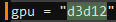
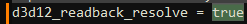

# Optional Upgrades

*These are some optional, but very handy additions you can make to your Green Day: Rock Band Deluxe installation.*

## Songs

By default, Green Day: Rock Band Deluxe allows all RB1/2 DLC to be loaded into the game. If you don't want this, head back to [Downloads](#downloads) and download a `Vanilla Songs Only` build.

You can find song packs compatible with all Rock Band titles for both platforms on [**This Spreadsheet**](https://docs.google.com/spreadsheets/d/1-3lo2ASxM-3yVr_JH14F7-Lc1v2_FcS5Rv_yDCANEmk/edit#gid=0).

You can also use [**Onyx Music Game Toolkit**](https://github.com/mtolly/onyxite-customs) to generate your own custom song packs for Rock Band games or convert Xbox 360 packs to PS3, and vice versa. Converting custom songs from games like Clone Hero is a breeze.

### Installing Songs on RPCS3

* Download a PS3 song pack of your choice and open RPCS3.
* Drag and drop the song pack you want to install on top of the main RPCS3 window and select `Yes` to install it.

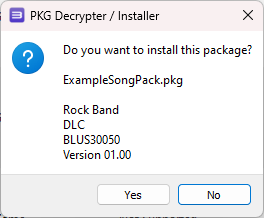

### Installing Songs on PS3

* Download a PS3 song pack of your choice and put it on the root of a USB drive.
* Open `Package Manager` and select the song pack you want to install.

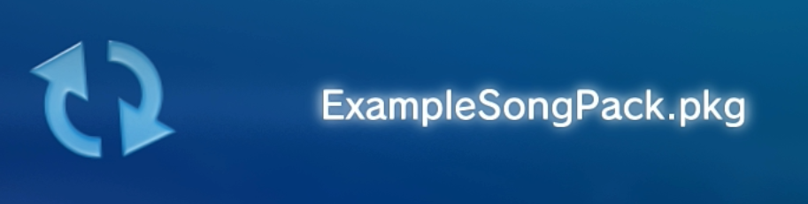

### Installing Songs on Xbox 360

* Download an Xbox 360 song pack of your choice.
* Copy it to its respective folder.

***For RB2 LIVE files, install them to:***

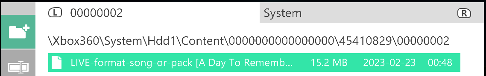

### Installing Songs on Xenia (Pointless)

* Download an Xbox 360 song pack of your choice.
* Open Xenia, navigate to `File > Install Content`, and select your song pack(s) of choice. You can select more than one at a time.
  * Xenia supports both CON and LIVE files.

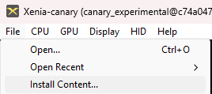

## Custom Textures

Green Day: Rock Band Deluxe has a variety of custom textures, found in the `Deluxe Settings` menu in-game, as well as a way to import your own with relative ease.

### Importing Your Own Textures

*Follow [**Repo Setup (Advanced)**](#repo-setup-advanced) first in order to properly follow this guide.*

* Copy any `.jpg`, `.png`, or `.bmp` file into `\custom_textures\***\`, then navigate back to `windows_bats` and run `process_textures_***.bat`.
  * These will make them show up in game, resize your images accordingly (including those with arbitrary resolutions), and convert them to the proper format for Green Day: Rock Band Deluxe to read.

***You will need to rebuild Green Day: Rock Band Deluxe in order for these to take effect.***

# Repo Setup (Advanced)

### Installing Required Dependencies

* Install [**Git for Windows**](https://gitforwindows.org/), [**Dot Net 6.0 Runtime**](https://dotnet.microsoft.com/en-us/download/dotnet/6.0/runtime), and [**Python**](https://www.python.org/downloads/) (version 3.9 or later).
  * Install **Git** and **Dot Net 6.0 Runtime** with their default options, and ***select "Add python.exe to PATH"*** on the **Python** installer.

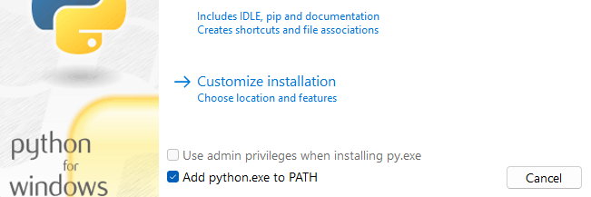

* Open a **new command prompt** (press `Win+R`, type `cmd` and press Enter), type in `pip install gitpython`, and press enter. Close the command prompt when it's done installing.

### Initializing the Repo

* Go to the **[Releases](https://github.com/hmxmilohax/greenday-rock-band-deluxe/releases)** of this repo and **download `_init_repo.bat`** if you're on Windows or **`_init_repo.sh`** if you're on Linux.
  * Make a new **empty** folder, **put `_init_repo` in the folder, and run it**. This will pull the repo down for you and make sure you're completely up to date. **This will take some time.**

### ***The folder should look like this once it's done:***

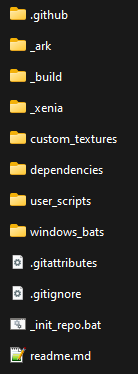

***The Green Day: Rock Band Deluxe repo is now set up!*** You can now return to [**Installing on Xenia (Advanced)**](#installing-on-xenia-advanced) or [**Custom Textures**](#custom-textures).

# Dependencies

[**Git for Windows**](https://gitforwindows.org/) - CLI application to allow auto updating Deluxe repo files

[**Dot Net 6.0 Runtime**](https://dotnet.microsoft.com/en-us/download/dotnet/6.0/runtime) - Needed to run ArkHelper

[**Python**](https://www.python.org/downloads/) - For user script functionality (NOTE: 3.9 or newer is highly recommended!)

[**Mackiloha**](https://github.com/PikminGuts92/Mackiloha) - ArkHelper for building Deluxe - SuperFreq for building .bmp_xbox highway images

[**swap_rb_art_bytes.py**](https://github.com/PikminGuts92/re-notes/blob/master/scripts/swap_rb_art_bytes.py) - Python script for converting Xbox images to PS3

[**dtab**](https://github.com/mtolly/dtab) - For serializing `.dtb` script files
